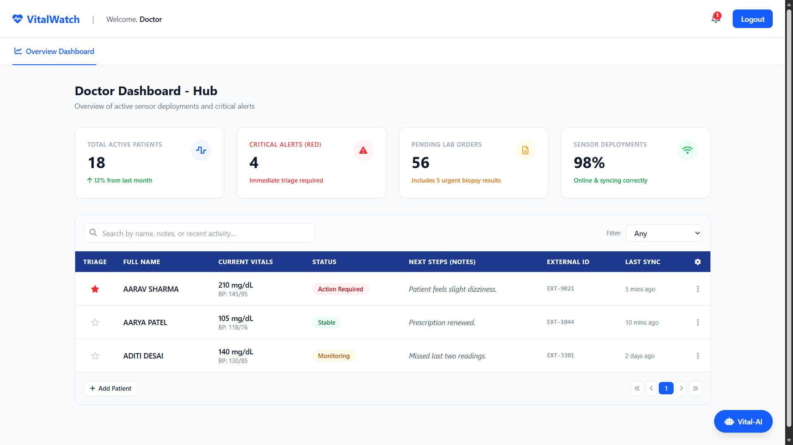

# VitalWatch: Real-Time Wearable Health Monitoring with GridDB Cloud

> **Medical Disclaimer:** All health metric estimations in this project (blood pressure, blood sugar) are simplified rule-based simulations for demonstration and educational purposes only. They are not clinically accurate and should never be used for real medical decision-making.

## Introduction

In healthcare, early warning often means the difference between a manageable situation and a critical emergency. Wearable devices like smartwatches and fitness bands now collect continuous streams of biometric data — heart rate, blood oxygen, temperature, and activity level — all day long.

While there is no shortage of data, most systems fail by evaluating each vital sign in isolation. They flag a high heart rate or a low SpO2 reading independently, without asking the obvious follow-up question: **are these two changes happening at the same time, and in a physiologically connected way?**

A standalone elevated heart rate reading might mean the wearer just walked upstairs. But if heart rate rises *and* SpO2 simultaneously drops *and* body temperature climbs — that is a physiological chain event, not a coincidence. Most dashboards miss that story.

VitalWatch addresses exactly this gap. Rather than building another static alert panel, we built a **Wearable Health Intelligence Layer** on top of GridDB Cloud that stores continuous vital sign streams, detects physiological chain events across multiple vital signs, and estimates derived health metrics like blood pressure and blood sugar from the raw sensor data.

## Why Time-Series Databases Matter for Wearable Health IoT

A standalone SpO2 reading of 91% doesn't tell the whole story. If it dropped from 98% in twenty minutes, it could indicate respiratory distress; if it has safely fluctuated between 90-92% for hours, it might just be a resting artifact. Evaluating sequences of readings over time provides the necessary context to tell the difference.

Wearable devices generate this time-series data continuously — potentially dozens of readings per minute across multiple sensors. Traditional relational databases, optimized for structured record storage and joins, were not designed for the high-frequency append-heavy workloads that wearable telemetry produces. They can struggle with the combination of write volume, timestamped queries, and time-window aggregations that health monitoring requires.

Time-series databases are purpose-built for this pattern. They act like a medical chart that never runs out of paper, allowing applications to look back at recent vital sign history and understand whether a wearer is moving toward an unsafe physiological state.

## Why GridDB Cloud for Wearable Health Monitoring

GridDB Cloud provides an environment where sensor telemetry storage and retrieval are handled efficiently, letting the monitoring application focus entirely on health analysis rather than database infrastructure management.

GridDB is a highly scalable, memory-first NoSQL database designed for high-frequency time-series IoT workloads. For VitalWatch, we use GridDB Cloud to:

1. Store continuous wearable sensor data in `TIME_SERIES` containers with timestamp-based row keys.
2. Maintain a fixed per-wearer schema for predictable, fast reads and writes.
3. Ingest vital sign data in memory first and persist it safely to disk.
4. Query recent time windows efficiently for early-warning detection.
5. Correlate multiple vital sign streams in real time for chain event detection.
6. Replay sensor history before an alert for physiological incident analysis.
7. Provide the historical dataset that trains the machine learning health risk classifier.

**Without GridDB:**
- Real-time multi-vital correlation would require expensive joins across separate tables.
- High-frequency wearable ingestion would create write bottlenecks.
- ML training on historical health data would require a separate ETL pipeline.

## System Architecture

VitalWatch simulates a small health monitoring scenario for three wearers — an Athlete, an Elderly Patient, and an Office Worker — enrolled in a group monitoring program. Each wearer carries a simulated smartwatch that generates Heart Rate, SpO2, Body Temperature, and Activity Level readings. Derived health metrics (estimated blood pressure and blood sugar) are computed from the raw readings before storage.


The overall system consists of the following main components:

**Sensor Simulation Layer**

A Python-based simulator generates realistic vital sign readings for each wearer. It applies a three-phase simulation model: Normal (all vitals safe), Stress (athlete begins showing cardiovascular signs), and Deterioration (athlete reaches critical levels while other wearers show secondary stress signals).

**Health Estimation Layer**

A rule-based estimator computes derived metrics — systolic/diastolic blood pressure and blood glucose — from the raw sensor values. These estimates are included in every row stored in GridDB so that the dashboard and ML model have access to the full health picture.

**Data Ingestion Layer**

The backend application receives simulated vital sign data and writes it to GridDB Cloud using the `multi_put` batch API, which allows rows for multiple wearer containers to be written in a single network round-trip.

**GridDB Cloud Database**

GridDB stores the complete vital sign history for each wearer in dedicated `TIME_SERIES` containers. The monitoring application queries this data to evaluate health conditions and detect physiological chain events.

**Monitoring Dashboard**

A web-based dashboard displays real-time vital signs, physiological chain alerts, and the fleet-wide health risk score. It polls the Flask API every three seconds and visualizes live trends using Chart.js.

**ML Health Risk Classifier**

A scikit-learn Random Forest classifier is trained directly on the historical data stored in GridDB. It learns to predict one of four health risk levels (Normal, Stress, Distress, Critical) from the seven-dimensional feature vector of each reading.

## Setting Up GridDB Cloud

To store wearable telemetry, a GridDB Cloud instance can be deployed through the Microsoft Azure Marketplace. After subscribing, you receive the cluster connection details including the notification provider address, cluster name, and authentication credentials.

Using the GridDB Python client, applications connect to the cluster through the native API. The following example shows how VitalWatch establishes a per-thread GridDB connection to avoid concurrency errors when multiple Flask worker threads are active:

```python
import griddb_python as griddb
import threading

_local = threading.local()

def get_store():
    """Return a per-thread GridDB connection to avoid concurrent access errors."""
    if not hasattr(_local, "store") or _local.store is None:
        factory = griddb.StoreFactory.get_instance()
        _local.store = factory.get_store(
            notification_member=NOTIFICATION_MEMBER,
            cluster_name=CLUSTER_NAME,
            username=USERNAME,
            password=PASSWORD,
        )
    return _local.store
```

Connection credentials are read from environment variables so that no secrets appear in source code.

## Project Overview

VitalWatch builds a smart health monitoring system for three simulated wearers enrolled in a group monitoring program. The system tracks each wearer's vitals continuously and identifies early signs of physiological stress before they become critical events.

Key ideas behind the system:

- **Multi-vital monitoring**: Rather than evaluating each vital sign independently, the system looks for correlated changes that indicate a linked physiological event.
- **Physiological chain detection**: It recognizes known biological relationships — for example, that falling SpO2 typically triggers compensatory heart rate elevation — and fires chain alerts when both sides of the correlation appear simultaneously.
- **Profile-aware thresholds**: Each wearer has individually tuned normal ranges and alert thresholds. An athlete's resting heart rate of 55 bpm is healthy; the same reading might warrant attention for a sedentary office worker.
- **Continuous risk scoring**: Instead of a binary safe/unsafe flag, each wearer receives a 0–100 risk score that moves smoothly as vitals drift toward danger zones.

## Simulating Wearable Sensor Data

Since real wearable devices are not available, the system uses a Python sensor simulator to generate realistic vital sign streams. The simulator creates readings for three wearer profiles:

- **Athlete**: Heart rate, SpO2, body temperature, activity level (trained physiology, lower resting HR)
- **Elderly Patient**: Heart rate, SpO2, body temperature, activity level (lower critical thresholds, highest monitoring priority)
- **Office Worker**: Heart rate, SpO2, body temperature, activity level (standard adult thresholds, sedentary baseline)

To model a realistic health event, the dataset is generated across three phases:

- **Normal**: All wearers operating within their safe vital ranges.
- **Stress**: The athlete begins showing cardiovascular stress — heart rate rises, SpO2 drops.
- **Deterioration**: The athlete reaches critical levels; the elderly patient begins showing secondary stress; the office worker shows early signs of physiological disturbance. This models how a shared environmental trigger (extreme heat, altitude) affects multiple wearers simultaneously.

To make the simulation physically plausible rather than generating flat hardcoded values, the system uses proportional interpolation with environmental noise:

```python
def _interpolate(low: float, high: float, progress: float = None) -> float:
    """Smoothly interpolate between two boundary values with optional random progress."""
    if progress is None:
        progress = random.uniform(0.0, 1.0)
    return low + progress * (high - low)

def generate_reading(wearer_id, status="Normal", progress=0.0, timestamp=None):
    nrm = WEARERS[wearer_id]["normal"]
    thr = WEARERS[wearer_id]["thresholds"]

    if status == "Stress":
        # HR ramps upward; SpO2 begins to drop (inverted: lower = worse)
        hr_base   = _interpolate(nrm["heart_rate"][1], thr["heart_rate"]["warning"], progress)
        spo2_base = _interpolate(nrm["spo2"][0], thr["spo2"]["warning"], progress)
        t_base    = _interpolate(nrm["temperature"][1], thr["temperature"]["warning"], progress * 0.6)

    # Environmental noise added to every reading regardless of phase
    noise_hr   = random.uniform(-2.0, 2.0)
    noise_spo2 = random.uniform(-0.3, 0.3)
    noise_temp = random.uniform(-0.1, 0.1)
```

This approach ensures that simulated vitals drift naturally toward thresholds rather than jumping abruptly, making the dashboard transitions visually and physiologically meaningful.


## Health Metric Estimation

One of VitalWatch's key additions is a rule-based health estimator that derives secondary health metrics from the raw wearable sensor data. Since wearable devices primarily measure heart rate, SpO2, temperature, and motion, higher-order metrics like blood pressure and blood glucose must be inferred.

The estimations use simplified physiological relationships that are deliberately documented as approximations:

```python
def estimate_systolic_bp(heart_rate: float, spo2: float, activity_level: float) -> float:
    """
    Estimate systolic blood pressure (mmHg) from HR, SpO2, and activity.
    NOTE: Simplified demonstration formula — not clinically accurate.
    """
    baseline     = 120.0
    hr_delta     = (heart_rate - 72) * 0.50    # HR deviation from resting reference
    activity_adj = (activity_level / 10.0) * 4.0
    spo2_stress  = max(0.0, (96.0 - spo2) * 0.80)  # hypoxic stress contribution
    noise        = random.uniform(-3.0, 3.0)
    return round(baseline + hr_delta + activity_adj + spo2_stress + noise, 1)


def estimate_blood_sugar(heart_rate: float, activity_level: float, spo2: float) -> float:
    """
    Estimate blood glucose (mg/dL) from HR, activity, and SpO2.
    NOTE: Simplified demonstration formula — not clinically accurate.
    """
    baseline     = 90.0
    hr_delta     = (heart_rate - 70) * 0.30
    activity_adj = activity_level * 0.40
    spo2_stress  = max(0.0, (96.0 - spo2) * 1.50)
    noise        = random.uniform(-5.0, 5.0)
    return round(baseline + hr_delta + activity_adj + spo2_stress + noise, 1)
```

A single `derive_health_metrics()` function acts as the entry point used by the sensor simulator so that every row stored in GridDB automatically includes the full estimated health picture:

```python
def derive_health_metrics(heart_rate, spo2, temperature, activity_level) -> dict:
    """Given raw vitals, return all derived health metric estimates."""
    return {
        "systolic_bp":  estimate_systolic_bp(heart_rate, spo2, activity_level),
        "diastolic_bp": estimate_diastolic_bp(heart_rate, activity_level),
        "blood_sugar":  estimate_blood_sugar(heart_rate, activity_level, spo2),
    }
```


## Live Alert Simulation

To demonstrate how a health deterioration event develops over time, the project includes a live alert simulation script. Rather than inserting a static pre-built dataset, the script gradually writes escalating vital sign readings into GridDB Cloud every second, mimicking how a real health event would evolve.

The simulation follows three stages:

- **Normal Baseline** – All wearers within safe ranges for the first few seconds.
- **Athlete Stress** – The athlete's heart rate climbs and SpO2 begins to drop, proportionally ramped using interpolation.
- **Full Deterioration** – The athlete reaches critical levels; the elderly patient shows secondary stress; the office worker starts showing early disturbance signals.

A simplified view of the simulation loop is shown below:

```python
def trigger_alert():
    """Simulates a live health event that persists until resolved on the dashboard."""
    store = insert_data.get_gridstore()
    start_sim()   # signals the Flask API that simulation is active

    i = 0
    while is_sim_active():
        ts    = datetime.now(timezone.utc)
        batch = {}

        for wearer_id in WEARERS:
            # Determine target health state based on simulation phase
            target = determine_phase(i, wearer_id)
            row    = make_row(ts, wearer_id, target)
            batch[WEARERS[wearer_id]["container"]] = [row]

        store.multi_put(batch)
        i += 1
        time.sleep(1)
```

When the dashboard operator clicks **"Alert Addressed"**, the Flask API clears the simulation flag. The script detects this, injects a final batch of normal-range readings into GridDB Cloud, and exits. Those healthy readings immediately restore the dashboard to a stable state without requiring a manual reset.


## Storing Health Data in GridDB Cloud

After generating the simulated vital sign readings, the data is stored in GridDB Cloud so the monitoring system can access recent history. Each wearer is assigned their own `TIME_SERIES` container with a fixed schema that stores all raw and derived health metrics.

The timestamp acts as the primary key, allowing efficient time-ordered storage and retrieval of each wearer's health history.

**Creating a `TIME_SERIES` container per wearer:**

```python
def setup_containers(store) -> dict:
    """Create one TIME_SERIES container per wearer profile."""
    containers = {}
    for wearer_id, cfg in WEARERS.items():
        con_info = griddb.ContainerInfo(
            cfg["container"],
            [
                ["timestamp",      griddb.Type.TIMESTAMP],
                ["heart_rate",     griddb.Type.DOUBLE],
                ["spo2",           griddb.Type.DOUBLE],
                ["temperature",    griddb.Type.DOUBLE],
                ["activity_level", griddb.Type.DOUBLE],
                ["systolic_bp",    griddb.Type.DOUBLE],   # estimated
                ["diastolic_bp",   griddb.Type.DOUBLE],   # estimated
                ["blood_sugar",    griddb.Type.DOUBLE],   # estimated
            ],
            griddb.ContainerType.TIME_SERIES,
        )
        containers[wearer_id] = store.put_container(con_info)
    return containers
```

**Inserting a full dataset using `multi_put`:**

```python
def insert_dataset(store, dataset: dict) -> None:
    """Bulk-insert all wearer readings in a single multi_put call."""
    batch = {}
    for wearer_id, readings in dataset.items():
        container_name = WEARERS[wearer_id]["container"]
        rows = []
        for r in readings:
            ts = datetime.fromisoformat(r["timestamp"].replace("Z", "+00:00"))
            rows.append([ts, r["heart_rate"], r["spo2"], r["temperature"],
                         r["activity_level"], r["systolic_bp"], r["diastolic_bp"],
                         r["blood_sugar"]])
        batch[container_name] = rows

    store.multi_put(batch)
```

The `multi_put` operation writes rows for all three wearer containers in a single request, significantly improving ingestion efficiency when handling continuous vital sign streams.


## Querying Health Data and Detecting Pre-Alert Conditions

Once vital sign data is stored in GridDB Cloud, the monitoring system queries recent readings to evaluate each wearer's health condition. The system retrieves the latest records from each wearer container using GridDB's Time-Series Query Language (TQL).

```python
def query_recent(store, wearer_id: str, limit: int = 20) -> list:
    """Fetch the most recent readings for a wearer using GridDB TQL."""
    container = store.get_container(WEARERS[wearer_id]["container"])

    query = container.query(f"select * order by timestamp desc limit {limit}")
    rs    = query.fetch()

    readings = []
    while rs.has_next():
        row = rs.next()
        readings.append({
            "timestamp":      row[0].isoformat(),
            "heart_rate":     row[1],
            "spo2":           row[2],
            "temperature":    row[3],
            "activity_level": row[4],
            "systolic_bp":    row[5],
            "diastolic_bp":   row[6],
            "blood_sugar":    row[7],
        })
    return readings
```

To avoid false alerts caused by momentary sensor spikes, the system evaluates health conditions using a rolling window of the three most recent readings. By averaging the latest values, the monitoring logic becomes stable and resistant to transient noise:

```python
window   = readings[:3]
avg_hr   = sum(r["heart_rate"]     for r in window) / len(window)
avg_spo2 = sum(r["spo2"]           for r in window) / len(window)
avg_temp = sum(r["temperature"]    for r in window) / len(window)
avg_act  = sum(r["activity_level"] for r in window) / len(window)
```

A key implementation detail is the handling of SpO2 as an **inverted vital**: unlike heart rate or temperature where higher values indicate danger, a *lower* SpO2 value indicates physiological risk. The severity function handles both directions using an `inverted` flag in the threshold configuration:

```python
def vital_severity(value: float, vital_key: str, wearer_id: str) -> float:
    """Return a 0.0–1.5 severity score. Handles both normal and inverted vitals."""
    thr      = WEARERS[wearer_id]["thresholds"][vital_key]
    inverted = thr.get("inverted", False)

    if inverted:
        # SpO2: lower value = higher severity
        normal_safe = WEARERS[wearer_id]["normal"][vital_key][0]
        if value >= normal_safe:              return 0.0
        elif value >= thr["warning"]:         return 0.30 * (normal_safe - value) / (normal_safe - thr["warning"])
        elif value >= thr["critical"]:        return 0.30 + 0.70 * (thr["warning"] - value) / (thr["warning"] - thr["critical"])
        else:
            overshoot = (thr["critical"] - value) / max(thr["warning"] - thr["critical"], 0.1)
            return min(1.0 + overshoot * 0.5, 1.50)
    else:
        # HR, temperature, activity: higher value = higher severity
        ...
```


## Risk Scoring

Instead of a simple status label, each wearer receives a continuous risk score between 0 and 100 based on exactly how far their vital signs have drifted from their individual safe ranges.

For example, an athlete with a heart rate of 160 bpm and an elderly patient both showing the same reading would receive very different risk scores, because their normal ranges and thresholds are configured independently.

```python
def wearer_risk_score(wearer_id, avg_hr, avg_spo2, avg_temp, avg_act) -> int:
    """Calculate a 0–100 health risk score using weighted vital severities."""
    s_hr   = vital_severity(avg_hr,   "heart_rate",     wearer_id)
    s_spo2 = vital_severity(avg_spo2, "spo2",           wearer_id)
    s_temp = vital_severity(avg_temp, "temperature",    wearer_id)
    s_act  = vital_severity(avg_act,  "activity_level", wearer_id)

    weighted = (
        s_hr   * VITAL_WEIGHTS["heart_rate"]     +   # 35%
        s_spo2 * VITAL_WEIGHTS["spo2"]           +   # 40%  ← SpO2 carries most weight
        s_temp * VITAL_WEIGHTS["temperature"]    +   # 15%
        s_act  * VITAL_WEIGHTS["activity_level"]     # 10%
    )
    return min(round(weighted * 100), 100)
```

The fleet-wide risk score is a weighted average across all wearers — the elderly patient contributes 50% of the weight because they are the highest-priority monitoring subject. Active physiological chain events add extra penalty points on top.


## Physiological Chain Detection

VitalWatch understands that vital signs are physiologically linked. A falling SpO2 causes the cardiovascular system to compensate by increasing heart rate. Sustained high heart rate generates excess metabolic heat, raising body temperature. These relationships are encoded as rules:

```python
VITAL_CHAIN_RULES = [
    {
        "source": "spo2",
        "target": "heart_rate",
        "message": (
            "Oxygen-Cardiac Chain: Falling SpO2 is driving compensatory heart rate elevation. "
            "The body is increasing cardiac output to offset reduced blood oxygen."
        ),
    },
    {
        "source": "heart_rate",
        "target": "temperature",
        "message": (
            "Cardiac-Thermal Chain: Elevated heart rate is correlating with rising body temperature. "
            "Increased metabolic activity is generating excess heat."
        ),
    },
    {
        "source": "spo2",
        "target": "temperature",
        "message": (
            "Full Physiological Chain: Simultaneous SpO2 desaturation and thermal elevation detected. "
            "This pattern may indicate acute physiological stress or systemic illness."
        ),
    },
]
```

The chain detection function evaluates each wearer's per-vital statuses against these rules. A chain alert fires only when the source vital is in a danger state *and* the target vital also shows an at-risk reading — confirming a linked physiological event rather than an isolated measurement anomaly:

```python
def detect_health_chains(wearer_id: str, vital_statuses: dict) -> list:
    chains      = []
    danger      = {"Distress", "Critical"}
    at_risk     = {"Stress", "Distress", "Critical"}

    for rule in VITAL_CHAIN_RULES:
        src = vital_statuses.get(rule["source"], "Normal")
        tgt = vital_statuses.get(rule["target"], "Normal")
        if src in danger and tgt in at_risk:
            chains.append({
                "wearer_id": wearer_id,
                "source":    rule["source"],
                "target":    rule["target"],
                "message":   rule["message"],
            })
    return chains
```


## Machine Learning Health Risk Classifier

VitalWatch includes a complete machine learning pipeline that uses the historical data stored in GridDB to train a health risk classifier. The model learns to predict one of four health states — Normal, Stress, Distress, or Critical — from the seven-dimensional feature vector of a single wearable reading.

**Why Random Forest?**

Random Forest is an ideal fit for this task because it seamlessly handles mixed physiological features across different units without requiring normalization. It also remains highly robust even with the smaller datasets typical of wearable monitoring demos. Additionally, the model outputs clear feature importances, making its health risk predictions easily explainable.

**Loading data from GridDB**

The training pipeline loads all available readings directly from the GridDB containers:

```python
def load_training_data(store) -> tuple:
    """Query all readings from GridDB and build a feature matrix with auto-generated labels."""
    X, y, wearer_labels = [], [], []

    for wearer_id in WEARERS:
        readings = query_recent(store, wearer_id, limit=500)

        for r in readings:
            features = [r["heart_rate"], r["spo2"], r["temperature"],
                        r["activity_level"], r["systolic_bp"],
                        r["diastolic_bp"], r["blood_sugar"]]
            # Labels are generated using the same rule-based logic as the dashboard
            label = STATUS_TO_INT[analyze_wearer(wearer_id, [r])["status"]]
            X.append(features)
            y.append(label)

    return np.array(X), np.array(y), wearer_labels
```

This approach makes labels consistent with the dashboard display: the ML model learns to replicate the same health risk judgments that the rule-based monitoring system makes, but as a learnable function of the raw feature values.

**Training and evaluation**

```python
model = RandomForestClassifier(
    n_estimators=150,
    max_depth=10,
    min_samples_leaf=2,
    random_state=42,
    n_jobs=-1,
)
model.fit(X_train, y_train)
```

After training, the pipeline prints a classification report and confusion matrix, followed by ranked feature importances:

```
  Feature Importances:
                  spo2  ████████████████████████████████████████  0.3912
            heart_rate  ████████████████████████████████          0.3104
           systolic_bp  ████████████                              0.1187
           blood_sugar  ████████                                  0.0823
           temperature  █████                                     0.0521
          diastolic_bp  ████                                      0.0401
        activity_level  ██                                        0.0052
```

SpO2 and heart rate emerge as the most predictive features — a result that aligns with the physiological chain rules encoded in the rule-based detection layer.


## Building the Monitoring Dashboard

Visualization is essential for making vital sign data actionable. The VitalWatch dashboard was built using HTML, JavaScript, and Chart.js to display real-time wearer status, vital sign trend charts, physiological chain alerts, and the fleet-wide health risk score.

The Flask backend exposes three main data API endpoints that the dashboard polls every three seconds:

| Endpoint | What it returns |
|---|---|
| `GET /api/fleet` | (Main) Status of all wearers + chain alerts + risk score |
| `GET /api/wearer/<id>` | Vital sign history for a single wearer (used for charts) |
| `GET /api/timeline` | Log of health status transitions over time |

A simplified view of the dashboard polling function:

```javascript
async function pollFleet() {
  try {
    const res  = await fetch('/api/fleet');
    const data = await res.json();

    // Update each wearer card
    for (const [wearerId, status] of Object.entries(data.wearers)) {
      setCard(wearerId, status.status, status.message, status.latest);
    }

    renderChains(data.chains || []);
    updateFleetScore(data.risk_score ?? 0);

  } catch (e) {
    console.error('Fleet poll failed:', e);
  }
}
```

The dashboard calls the fleet endpoint every three seconds to keep the interface synchronized with the latest health data in GridDB Cloud. The chart endpoint provides rolling vital sign history for each wearer, rendered as a dual-axis mini trend chart (HR on the left axis, SpO2 on the right).


## Running the Project

Make sure GridDB Cloud is running and credentials are configured as environment variables. Then run the following in order:

```bash
# Step 1: Create containers and seed historical data
$ python src/insert_data.py

# Step 2: Start the monitoring backend
$ python src/app.py

# Step 3 (optional): Keep the dashboard alive with a live heartbeat
$ python src/insert_data.py --live

# Step 4 (optional): Trigger a live alert simulation
$ python src/simulate_alert.py

# Step 5 (optional): Train the ML health risk classifier
$ python src/train_model.py
```

Open `http://localhost:5000` to view the dashboard.

**The Background Heartbeat (`insert_data.py --live`)**: This script provides a stable, healthy baseline so the dashboard stays "green" by default.

**The Manual Alert (`simulate_alert.py`)**: This script temporarily introduces a deteriorating health event to show how vital signs cascade. Click **"Alert Addressed"** in the dashboard to resolve it.

One of the advantages of using GridDB for this architecture is automatic recovery: once the simulation finishes, the background producer continues sending normal-range readings. These healthy readings naturally displace the temporary critical spikes in the rolling query window, and the system returns to a safe state without a manual database reset.

## Results and Dashboard Overview

After running the system, the monitoring dashboard displays the real-time health status of all three wearers. The interface shows live vital signs for Heart Rate, SpO2, Body Temperature, and Activity Level for each wearer, along with trend charts, chain alert panels, and the fleet-wide risk score.

**Normal State**

In the normal state, all wearers show green status indicators and a fleet risk score near 0. The escalation timeline panel is empty, confirming no status transitions have occurred.


**Stress Detected**

As the athlete's heart rate climbs and SpO2 begins to fall, individual vital signs transition to warning state. The athlete card updates to "Stress" and the overall risk score begins rising.


**Physiological Chains Active**

When the athlete's SpO2 drops into the danger zone while heart rate is simultaneously elevated, the system fires a chain alert: "Oxygen-Cardiac Chain: Falling SpO2 is driving compensatory heart rate elevation." A second chain may fire if body temperature also begins rising.


**Alert Resolved**

Once the operator clicks "Alert Addressed," the simulation stops, recovery readings are injected, and the dashboard returns to normal. The risk score drops back toward zero and chain alerts clear.


By visualizing vital sign trends, physiological chain events, and fleet risk levels together, the dashboard gives health monitoring operators a clear and actionable picture of wearer health states.

## Conclusion

Wearable health monitoring generates high-frequency, time-ordered data that tells a much richer story than any single sensor reading. Detecting that story requires a database purpose-built for time-series workloads and an analysis layer that understands physiological correlations rather than evaluating each vital in isolation.

In this project, we built VitalWatch — a complete wearable health monitoring prototype using GridDB Cloud to store and query vital sign telemetry. By combining simulated sensor readings with rule-based physiological chain detection and a machine learning health risk classifier, the system can detect early warning patterns before they escalate into critical events.

The complete implementation can be found in the project repository. :
https://github.com/DoneByManthan/GridDB-VitalWatch.git

In the future, this approach could be extended with:

- **Personalized ML models** trained on each wearer's individual baseline rather than group averages stored in GridDB.
- **Anomaly detection** using unsupervised methods (e.g., Isolation Forest) on the GridDB historical data to catch unusual patterns that fall outside rule-defined thresholds.
- **Real device integration** by replacing the Python simulator with a Bluetooth LE or MQTT data ingestion layer that receives readings directly from consumer wearables.
- **Federated learning** where each wearer's device trains a local model on-device and only sends model weight updates to a central server, preserving health data privacy while improving the global classifier.
